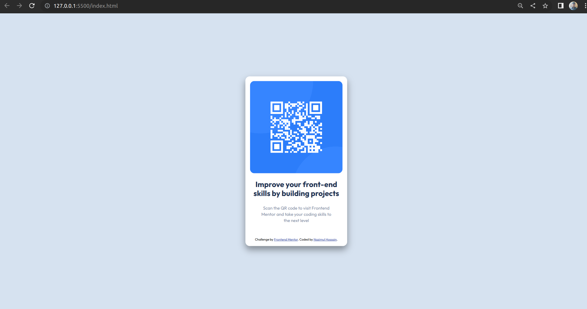
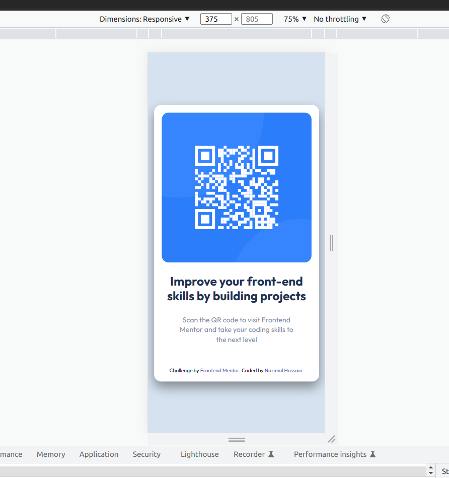

# Frontend Mentor - QR code component solution

This is a solution to the [QR code component challenge on Frontend Mentor](https://www.frontendmentor.io/challenges/qr-code-component-iux_sIO_H). Frontend Mentor challenges help you improve your coding skills by building realistic projects.

## Table of contents

- [Overview](#overview)
  - [Screenshot](#screenshot)
  - [Links](#links)
- [My process](#my-process)
  - [Built with](#built-with)
  - [What I learned](#what-i-learned)

## Overview

### Screenshot

- Desktop Screenshoot :



- Mobile Screenshoot:



### Links

- Solution URL: (https://github.com/nazimulhossain/frontend-mentor-qr-code)
- Live Site URL: (https://delightful-dango-5022c9.netlify.app/)

## My process

### Built with

- Semantic HTML5 markup
- CSS custom properties
- Flexbox

### What I learned

For centering the qr box inside the container we can use flexbox or grid, absolute positioning not needed for this.

To see how you can add code snippets, see below:

- Using Flex Box :

```css
body {
  font-family: 'Outfit', sans-serif;
  min-height: 100vh;
  background-color: hsl(212, 45%, 89%);
  display: flex;
  flex-direction: column;
  justify-content: center;
  align-content: center;
  flex-wrap: wrap;
}
```

- Using Grid:

```css
body {
  min-height: 100vh;
  display: grid;
  place-items: centerl;
}
```
